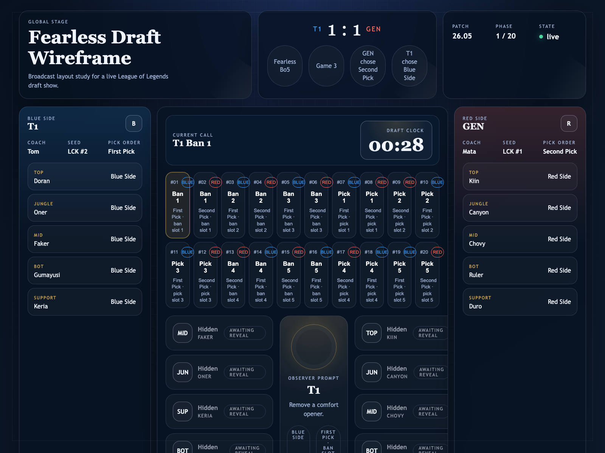
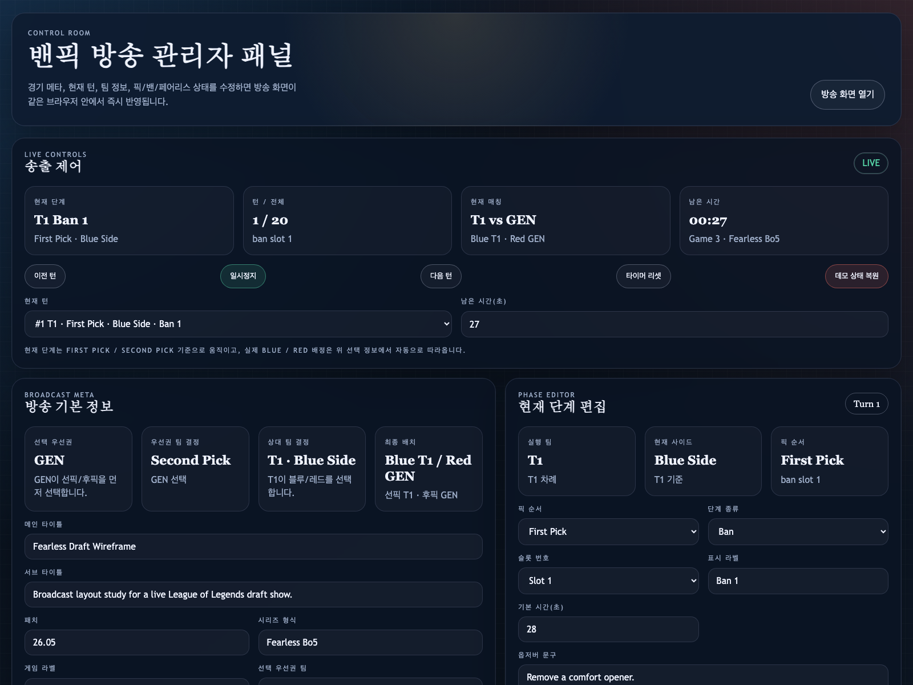

# LoL Banpick Broadcast Wireframe

리그 오브 레전드 밴픽 방송 화면을 웹으로 실험하기 위한 정적 프로토타입입니다.  
방송용 오버레이 화면과 관리자 패널이 `localStorage`를 통해 같은 브라우저 안에서 실시간으로 동기화됩니다.

## 미리보기

### Broadcast View



### Admin Panel



## 주요 기능

- 방송용 밴픽 와이어프레임 화면
- 관리자 패널에서 경기 메타, 현재 턴, 팀 정보, 픽/밴/Fearless 상태 편집
- 한 팀이 먼저 `First Pick / Second Pick`를 선택하고, 다른 팀이 `Blue Side / Red Side`를 선택하는 드래프트 흐름
- 방송 화면과 관리자 패널 간 실시간 상태 동기화
- 키보드 조작으로 턴 이동, 타이머 제어, 전체화면 전환
- `window.render_game_to_text()` 기반 텍스트 상태 출력

## 화면 구성

### `index.html`

방송용 화면입니다.

- 상단 경기 메타, 패치, 현재 페이즈 상태
- 좌우 블루/레드 팀 패널
- 중앙 드래프트 타임라인, 현재 콜, 픽/밴 슬롯
- 하단 Fearless Draft 메모리 보드

### `admin.html`

운영용 관리자 패널입니다.

- 현재 턴 이동
- 재생 / 일시정지
- 타이머 리셋
- 방송 타이틀 및 시리즈 정보 편집
- `선택 우선권 팀 -> 선픽/후픽 선택 -> 상대 팀 블루/레드 선택` 흐름 설정
- 팀별 로스터, 픽, 밴, Fearless 데이터 수정

## 로컬 실행

추가 빌드 도구 없이 바로 실행할 수 있습니다.

```bash
python3 -m http.server 8123 --bind 127.0.0.1
```

브라우저에서 아래 주소를 열면 됩니다.

- 방송 화면: [http://127.0.0.1:8123](http://127.0.0.1:8123)
- 관리자 패널: [http://127.0.0.1:8123/admin.html](http://127.0.0.1:8123/admin.html)

같은 브라우저 안에서 두 페이지를 함께 열어야 `localStorage` 동기화가 자연스럽게 보입니다.

## 조작 방법

방송 화면 기준 단축키입니다.

- `Left` / `Right`: 이전 턴 / 다음 턴
- `Space`: 재생 / 일시정지
- `R`: 현재 턴 타이머 리셋
- `F`: 전체화면 전환

## 상태 구조

공유 상태는 `draft-state.js`에 있습니다.

- `broadcast`: 화면 타이틀, 서브 타이틀
- `series`: 패치, 시리즈 형식, 게임 라벨
- `selection`: 우선권 팀, 선픽/후픽 선택, 상대 팀의 블루/레드 선택
- `teams`: 팀 정보, 로스터, 픽, 밴, Fearless 데이터
- `sequence`: 밴픽 턴 순서
- `live`: 현재 턴 인덱스, 남은 시간, 재생 상태

## 테스트 훅

자동 검증과 상태 확인을 위해 아래 훅을 제공합니다.

```js
window.render_game_to_text();
window.advanceTime(1000);
window.resetWireframe();
```

`render_game_to_text()`는 현재 방송 화면 기준 상태를 JSON 문자열로 반환합니다.

## 파일 구조

```text
.
├── index.html
├── admin.html
├── main.js
├── admin.js
├── draft-state.js
├── styles.css
├── admin.css
├── progress.md
└── test-artifacts/
```

## 검증 메모

- 로컬 Python HTTP 서버로 페이지 응답 확인
- Headless Chrome DevTools 기반으로 관리자 패널과 방송 화면 동기화 검증
- `GEN -> Second Pick`, `T1 -> Blue Side` 시나리오에서 `T1 = Blue + First Pick`, `GEN = Red + Second Pick` 반영 확인
- 페이지 런타임 예외 및 warning/error 콘솔 항목 없음 확인

참고로 현재 워크스페이스에는 `npx`가 없어 Playwright 대신 Chrome DevTools 경로로 검증했습니다.

## 한계

- 실제 Riot API, Data Dragon, 챔피언 이미지 연동은 아직 없음
- 저장 데이터는 브라우저 `localStorage`에만 유지됨
- 서버 동기화, 다중 운영자 협업, OBS 최적화는 아직 미구현

## 안내

이 프로젝트는 팬메이드 UI 와이어프레임/프로토타입입니다.  
Riot Games의 공식 제품이 아니며, 현재 저장소에는 Riot의 공식 에셋이나 상표 사용물이 포함되어 있지 않습니다.
